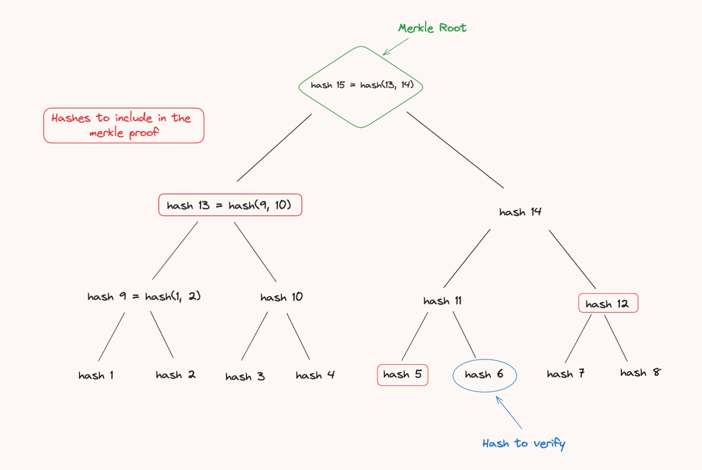

# Merkle Tree contract

A Merkle tree, also known as a hash tree, is a data structure used in cryptography and computer science to verify data integrity and consistency. It is a binary tree where each leaf node represents the cryptographic hash of some data (a transaction for example), and each non-leaf node represents the cryptographic hash of its child nodes. This hierarchical structure allows efficient and secure verification of the data integrity.

Here's a quick summary of how it operates and what functionalities it supports:

### How it works:

1. Leaves Creation:
    - Some data is hashed to create a leaf node.
2. Intermediate Nodes Creation:
    - Pairwise hashes of the leaf nodes are combined and hashed again to create parent nodes.
    - This process continues until only one hash remains, known as the Merkle root.
3. Merkle Root:
    - The final hash at the top of the tree, representing the entire dataset.
    - Changing any single data block will change its corresponding leaf node, which will propagate up the tree, altering the Merkle root.

### Key Features:

1. Efficient Verification:
    - Only a small subset of the tree (the Merkle proof) is needed to verify the inclusion of a particular data block, reducing the amount of data that must be processed.

2. Data Integrity:
    - The Merkle root ensures the integrity of all the underlying data blocks.
    - Any alteration in the data will result in a different root hash.

### Examples of use cases:

1. Fundamental use case: Ethereum blockchain integrity
    - Cryptocurrencies like Bitcoin and Ethereum use Merkle trees to efficiently summarize and validate transactions within a block. This process is crucial for ensuring the integrity and immutability of the blockchain.

    - Here is the process detailed:
        1. In a block, each transaction is hashed to form the leaf nodes of the merkle tree.
        2. As explained, pairwise hashes of the leaf nodes are combined and hashed again to create parent nodes. We do this recursively until we obtain a single hash, the merkle root. Here, the Merkle root represents a compact and efficient summary of all transactions within the block
        3. The Merkle root is included in the block header, along with other important information like the previous block hash, timestamp, and nonce.
        4. This header is then hashed to form the block's hash, which uniquely identifies the block in the blockchain.

    - Guaranteed Integrity: If a node tries to tamper with a transaction, it will change the transaction hash, changing the merkle root hash of the transactions of the block, resulting in a different block header hash, resulting in a different block hash. Therefore, the other nodes will easily see the change and will not accept the block.

    - Transaction verification: When a node needs to verify a specific transaction, it does not need to download the entire block.  Instead, it can use a Merkle proof (a path of hashes from the transaction to the Merkle root) to prove that the transaction is included in the block.

2. Whitelist inclusion
    - One common use case of Merkle trees in blockchain is to verify whether a particular address is part of a whitelist, without having to store the entire list on-chain. This is efficient and cost-effective due to reduced on-chain storage costs.

    - This method consists in saving the merkle root of the whitelist on-chain, while the entire list is stored elsewhere off-chain. To verify inclusion of an address, a user provides a Merkle proof and the address whose inclusion they want to verify. The merkle root will be re-computed thanks to the provided data (address here) and the merkle proof, before being verified against the merkle proof stored on-chain. If they match, the address passed is indeed included in the whitelist. Otherwise, it is not included.

3. Decentralized Identity Verification
    - Merkle trees can be used in decentralized identity systems to verify credentials.
    - Off-chain data: a user's credentials.
    - On-chain data: the Merkle root representing the credentials.

### Visual Example



The above diagram represents a merkle tree.\
Each leaf node is the hash of some data.\
Each other node is the hash of the combination of both children nodes.

If we were to `verify` the `hash 6`, the merkle proof would need to contain the `hash 5`, `hash 12`and `hash 13`:
  1. The `hash 5` would be combined with the `hash 6` to re-compute the `hash 11`.
  2. The newly computed `hash 11` in step 1 would be combined with `hash 12` to re-compute `hash 14`.
  3. The newly computed `hash 14` in step 2 would be combined with `hash 13` to re-compute the merkle root.
  4. We can then compare the computed resultant merkle root with the one provided to the `verify` function.

### Code

The following implementation is the Cairo adaptation of the [Solidity by Example - Merkle Tree contract](https://solidity-by-example.org/app/merkle-tree/).

```rust
{{#include ../../listings/applications/merkle_tree/src/contract.cairo}}
```
